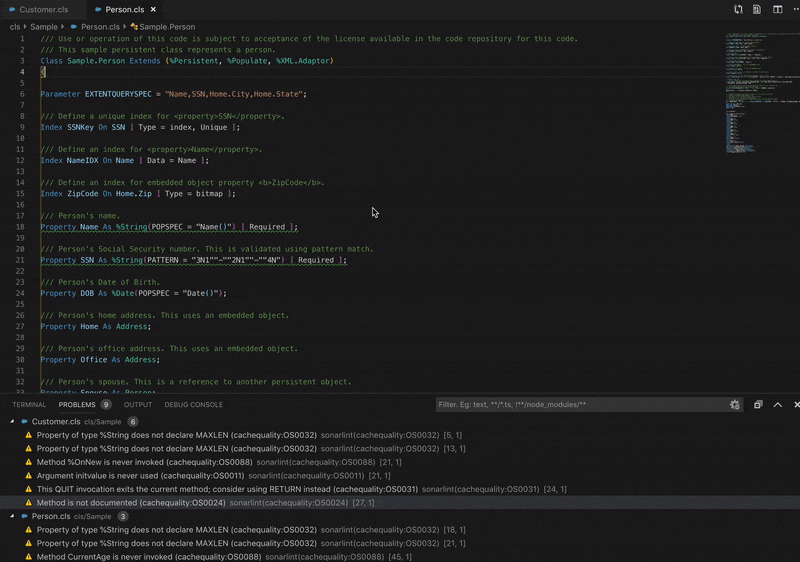
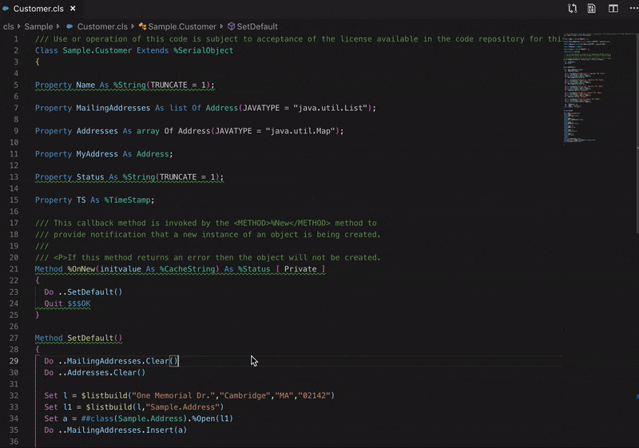

# objectscriptQuality for Visual Studio Code

objectscriptQuality for VSCode is an IDE extension that helps you detect and fix quality issues as you write code. Like a spell checker,  this plugin  squiggles flaws so they can be fixed before committing code. You can get it directly from the VS Code Marketplace and it will then detect new bugs and quality issues as you code (ObjectScript and JavaScript)

## How it works

Simply open a INT, MAC, CLS or JS file, start coding, and you will start seeing issues reported by objectscriptQuality. Issues are highlighted in your code, and also listed in the 'Problems' panel.

You can access the detailed rule description directly from your editor, using the provided contextual menu.

## Static Analysis Rules

Check the rules to see what objectscriptQuality can do for you:

- [ObjectScript rules](https://www.objectscriptQuality.com/docs/objectscriptquality-release/rules)
- [JavaScript rules](https://rules.sonarsource.com/javascript)

You will benefit from the following code analyzers: [objectscriptQuality](https://www.objectscriptQuality.com) and [SonarJS](https://redirect.sonarsource.com/plugins/javascript.html)

## Requirements

The SonarLint language server needs a Java Runtime (JRE) 8 or 11. If one is already installed on your computer, SonarLint should automatically find and use it.

objectscriptQuality should automatically find it but you can also explicitly set the path where the JRE is installed using the 'objectscriptQuality.ls.javaHome' variable in VS Code settings. For example:

Finally, you can explicitly set the path where the JRE is installed using the `sonarlint.ls.javaHome` variable in VS Code settings. For instance:

    {
        "sonarlint.ls.javaHome": "C:\\Program Files\\Java\\jre1.8.0_131"
    }

To analyze JavaScript and TypeScript, SonarLint will also need Node.js.

To enable the support for Java, you need the [Language support for Java](https://marketplace.visualstudio.com/items?itemName=redhat.java) VSCode extension (version 0.56.0 or higher).

The support for Apex and PL/SQL is only available together with SonarQube/SonarCloud. For Apex, you'll also need the [Salesforce Extension Pack](https://marketplace.visualstudio.com/items?itemName=salesforce.salesforcedx-vscode) VSCode extension.

## Connected mode

You can connect SonarLint to SonarQube >= 6.7 or SonarCloud and bind your workspace folders to a SonarQube/SonarCloud project to benefit from the same rules and settings that are used to inspect your project on the server. SonarLint then hides in VSCode the issues that are marked as **Won’t Fix** or **False Positive**.

Connected mode will also allow to unlock analysis of those languages:

- [Apex rules](https://rules.sonarsource.com/apex)
- [PL/SQL rules](https://rules.sonarsource.com/plsql).

The first step is to configure connection details (user token, SonarQube server URL or SonarCloud organization). For security reasons, the token should not be stored in SCM with workspace settings. That's why we suggest to configure them in VSCode user settings.

Example for SonarQube:

    {
        "sonarlint.connectedMode.connections.sonarqube": [
            { "serverUrl": "https://sonarqube.mycompany.com", "token": "<generated from SonarQube account/security page>" }
        ]
    }

Example for SonarCloud:

    {
        "sonarlint.connectedMode.connections.sonarcloud": [
            { "organizationKey": "myOrgOnSonarCloud", "token": "<generated from https://sonarcloud.io/account/security/>" }
        ]
    }

The second step is to configure the project binding, either at workspace level, or in every workspace folders. Example:

    {
        "sonarlint.connectedMode.project": {
            "projectKey": "the-project-key"
        }
    }

If you plan to use multiple connections, to different SonarQube servers and/or SonarCloud organizations, simply give a unique `connectionId` to each entry, and use them as reference in the binding.

Example:

    // In user settings
    {
        "sonarlint.connectedMode.connections.sonarqube": [
            { "connectionId": "mySonar", "serverUrl": "https://sonarqube.mycompany.com", "token": "xxx" }
        ]
        "sonarlint.connectedMode.connections.sonarcloud": [
            { "connectionId": "myOrgOnSonarCloud", "organizationKey": "myOrg", "token": "yyy" }
        ]
    }

    // In project1/.vscode/settings.json
    {
        "objectscriptQuality.ls.javaHome": "C:\Program Files\Java\jre1.8.0_131"
    }

    // In project2/.vscode/settings.json
    {
        "sonarlint.connectedMode.project": {
            "connectionId": "SonarCloud",
            "projectKey": "the-project-key-on-sc"
        }
    }

Configuring a project binding at the workspace level mutes **Won’t Fix** and **False Positive** issues in any of the project's sub-folders added to the workspace.

SonarLint keep server side data in a local storage. If you change something on the server such as the quality profile, you can trigger an update of the local storage using the "SonarLint: Update all project bindings to SonarQube/SonarCloud" command on the command palette (search for "sonarlint").

## Contributions

If you would like to see a new feature, please create a new thread in the forum ["Suggest new features"](https://community.sonarsource.com/c/suggestions/features).

Please be aware that we are not actively looking for feature contributions. The truth is that it's extremely difficult for someone outside SonarSource to comply with our roadmap and expectations. Therefore, we typically only accept minor cosmetic changes and typo fixes.

With that in mind, if you would like to submit a code contribution, please create a pull request for this repository. Please explain your motives to contribute this change: what problem you are trying to fix, what improvement you are trying to make.

Make sure that you follow our [code style](https://github.com/SonarSource/sonar-developer-toolset#code-style) and all tests are passing.

You can connect objectscriptQuality to SonarQube >= 5.6 or SonarCloud to benefit from the same rules and settings that are used to inspect your project on the server. objectscriptQuality then hides in VSCode the issues that are marked as **Won’t Fix** or **False Positive**.

To configure the connection, have a look at objectscriptQuality in default user settings.

If you change something on the server such as the quality profile, you can trigger an update of the local cache using the "Update objectscriptQuality binding to SonarQube/SonarCloud" command on the command palette (search for "sonarlint").

Issue tracker (readonly): https://jira.sonarsource.com/browse/SLVSCODE

## License

objectscriptQuality for VSCode is a software distributed under freeware basis. This software is composed of the objectscriptQuality plugin and a modified version of SonarLint.

SonarLint is a trademark of SonarSource S.A., and is free software; you can redistribute it and/or modify it under the terms of the GNU Lesser General Public License as published by the Free Software Foundation; either version 3 of the License, or (at your option) any later version. See the GNU Lesser General Public License for more details.

CachéQuality for VSCode is distributed in the hope that it will be useful, but WITHOUT ANY WARRANTY; without even the implied warranty of MERCHANTABILITY or FITNESS FOR A PARTICULAR PURPOSE.

## Feedback

The preferred way to discuss about objectscriptQuality for VSCode is by posting on the [Project Issues tab](https://github.com/litesolutions/objectscriptquality-vscode/issues). Feel free to ask questions, report issues, and give suggestions.
